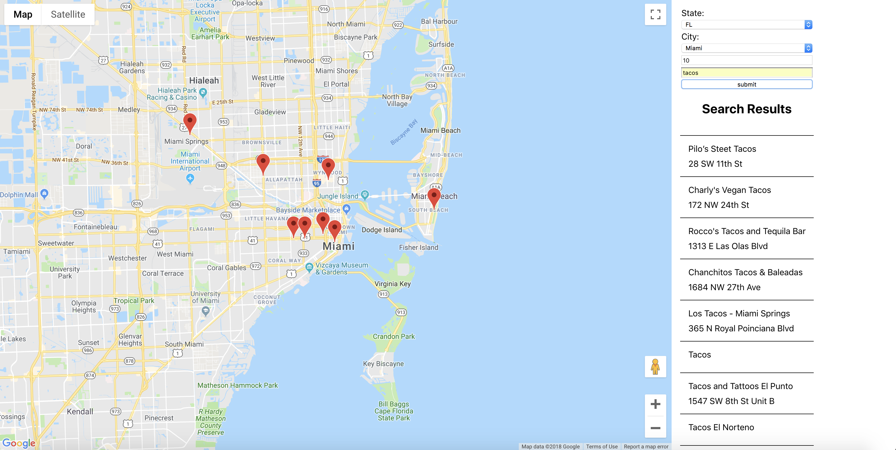

# Neighborhood Maps #
Neighborhood maps is a single-page react app made for the Udacity front-end development nanodegree program. Search for different things, such as restaurants, apartments, and watch the markers appear on the map. Select how many markers you wish to appear. Currently, five total cities in Florida and New York are supported.

## To Run ##
In terminal, type ```npm install``` to install dependencies. Next, use ```npm start``` to start the app in your browser.

### To Run in Production Mode ###
This is necessary in order to see how the service worker allows users to still access the site while offline. In terminal, type ```npm run build```. When it finishes building, make sure serve is installed on your machine by running ```npm install -g serve```. Finally run ```serve -s build```

## Resources ##
[React Google Maps](https://github.com/tomchentw/react-google-maps) was used to easily integrate the google maps with react. The [FoursquareAPI](https://developer.foursquare.com/) was used to gather pictures, names, and addresses for each location found in the results. 

## Screenshot ##


## Contributions ##
Contributions would be greatly appreciate it. If there is anything you might like to add, please do not hesitate to contact me. 
